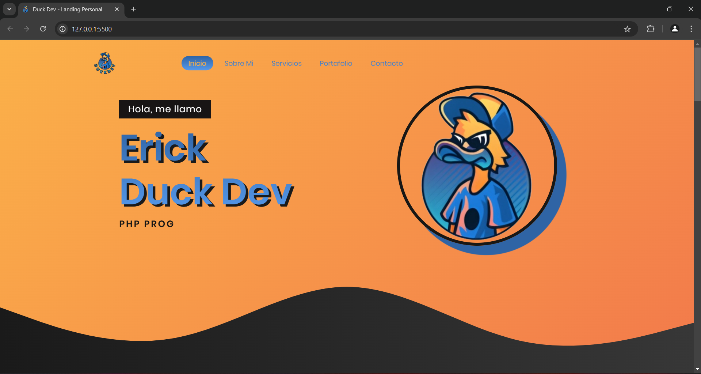
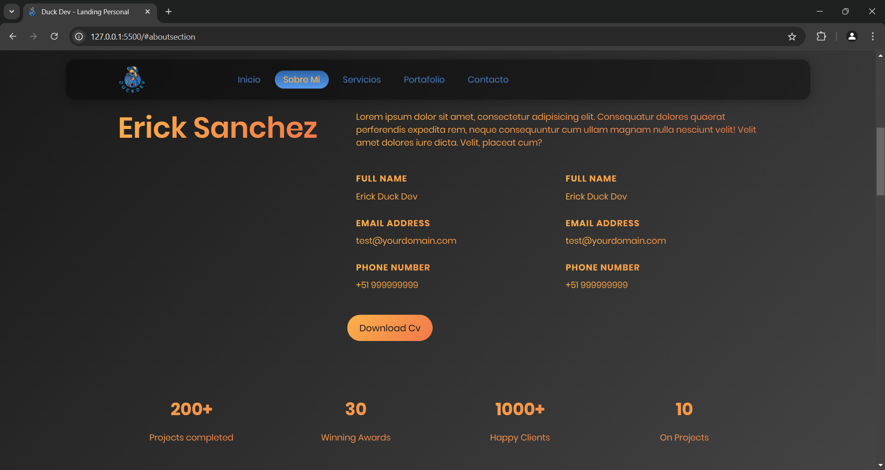
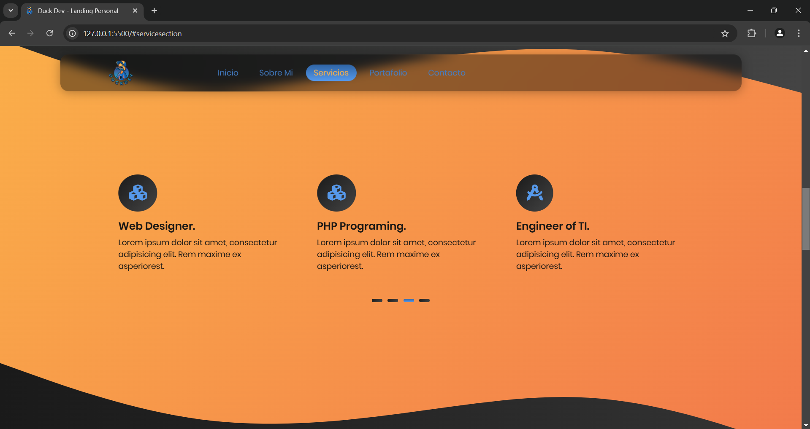

# Landig Page Personal

Esta landing page está diseñada para ofrecer una experiencia visual atractiva y dinámica. Es una página estática pero con funciones interactivas que mejoran la experiencia del usuario. Con un diseño limpio y moderno, incluye animaciones fluidas que capturan la atención del visitante, haciendo que la información se entregue de manera efectiva y memorable. El objetivo principal es presentar de forma clara y llamativa los datos importantes, mientras se ofrece una navegación intuitiva. Esta página busca no solo informar, sino también generar un impacto positivo, guiando al usuario a través de una experiencia fluida y visualmente estimulante.

### Tecnologías utilizadas

- HTML5
- CSS3
- JavaScript

## Authors

- [@erijosanchez](https://github.com/erijosanchez)

## 🚀 About Me

Soy Erick José Sánchez Pinedo, Desarrollador web e ingeniero de tecnologías de la información y comunicación.
## FAQ

#### ¿Duck Dev?

Duck Dev es un proyecto personal mío para desarrollar y comercializar webs con excelentes diseños y rendimiento para todo tipo de público.
Teniendo en consideración al equipo de trabajo y al cliente quien es lo mas importante para nosotros.

## Screenshots

